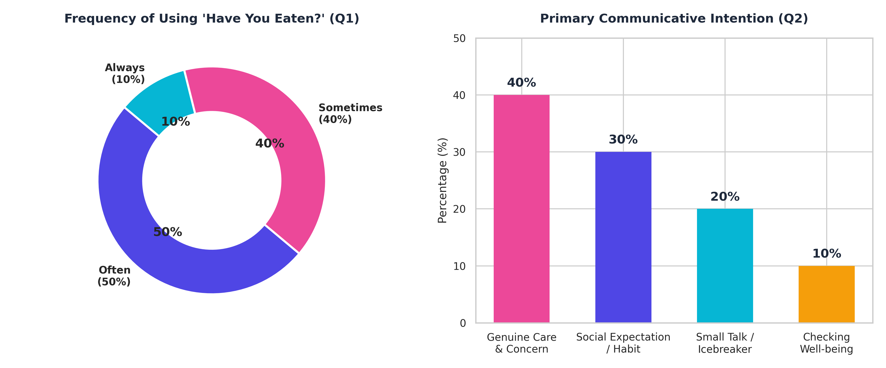
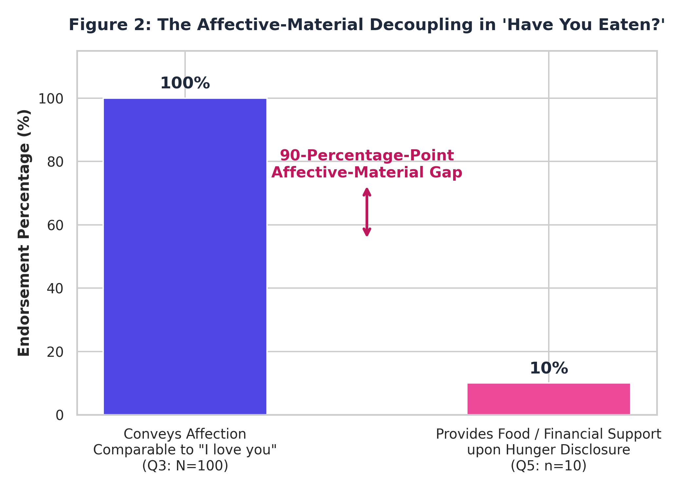
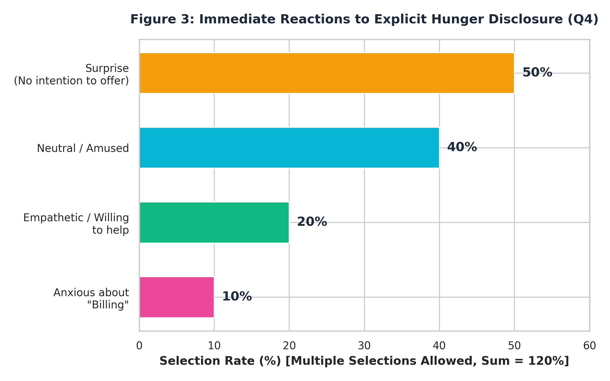
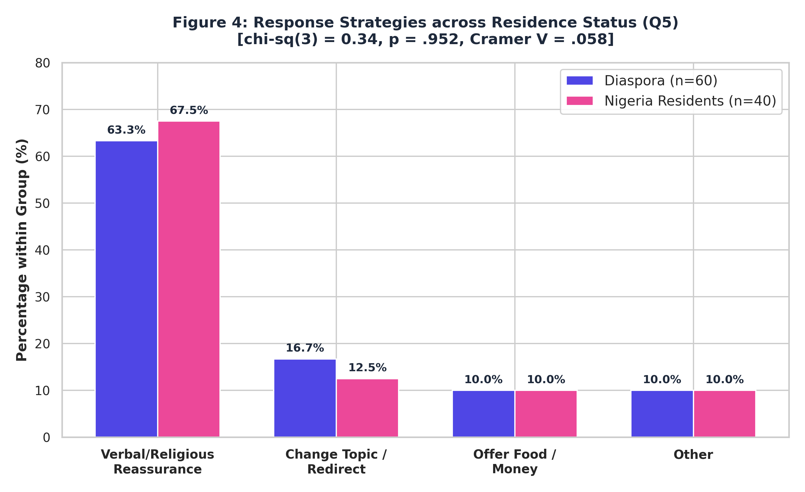

# Between Care and "Billing": Decoding Linguistic Masking and Transnational Identity in the Nigerian Greeting "Have You Eaten?"

[](https://doi.org/10.5281/zenodo.22930424)
[](https://github.com/Pegi1727/Nigerian-pragmatics-linguistic-masking/releases/tag/0.1.Sociopragmatics)
[](https://creativecommons.org/licenses/by/4.0/)
[](https://www.python.org/)
[](https://www.r-project.org/)

---

## Overview

This repository contains the complete replication package, anonymized dataset ($N = 100$), survey instruments, statistical scripts, and high-resolution visualizations for the empirical sociopragmatic study:

> **Merrikhi, P. (2026).** *Between Care and "Billing": Decoding Linguistic Masking and Transnational Identity in the Nigerian Greeting "Have You Eaten?"*

The study investigates how the ubiquitous Nigerian English formulaic utterance *"Have you eaten?"* functions as a site of **linguistic masking**—balancing affective solidarity with socioeconomic hedging across transnational diaspora ($n = 60$) and domestic Nigerian residents ($n = 40$).

---

## Graphical Abstract


---

## Key Figures & Empirical Findings

### Figure 1: General Usage Frequency and Primary Communicative Intent

*Distribution of routine usage frequency (Q1) alongside primary illocutionary goals (Q2), demonstrating high baseline prevalence dominated by affective care and social convention.*

---

### Figure 2: The Affective–Material Decoupling

*Endorsement rates comparing universal perception of affective care (Q3: 100%) against material financial intervention upon explicit hunger disclosure (Q5: 10%).*

---

### Figure 3: Immediate Reactions to Explicit Hunger Disclosure (Q4)

*Multi-response distribution of initial communicative reactions when interlocutors unexpectedly report having not eaten.*

---

### Figure 4: Response Strategies Across Residence Groups (Q5)

*Comparative breakdown illustrating cross-contextual stability between Nigerian Residents ($n = 40$) and Diaspora members ($n = 60$).*

---

## Summary of Empirical Results

| Item / Dimension | Operational Measure | Quantitative Finding | Statistical Metric & Verification |
| :--- | :--- | :--- | :--- |
| **Q1: Frequency of Use** | Self-reported routine usage | Often: 50%<br>Sometimes: 40%<br>Always: 10% | Universal pragmatic currency across sample ($N = 100$). |
| **Q2: Primary Intent** | Core illocutionary motive | Care / Empathy: 40%<br>Habit / Expectation: 30%<br>Small Talk: 20%<br>Condition Check: 10% | Relational care constitutes the primary stated function. |
| **Q3: Affective Consensus** | Care / solidarity interpretation | **100% agreement** ($n = 100/100$) | Wilson 95% CI: $[96.38\%, 100.00\%]$. |
| **Q4: Immediate Reactions** | Responses to explicit hunger *(multi-response)* | Verbal Sympathy: 50%<br>Ask Why: 40%<br>Offer Food: 20%<br>Assume Joke: 10% | Total selections = 120% across multi-response options. |
| **Q5: Pragmatic Strategies** | Concrete conversational reaction | Verbal/Spiritual Reassurance: 65%<br>Topic Shift: 15%<br>**Direct Material Aid: 10%**<br>Other: 10% | **Decoupling verified**: Binomial test ($10\%$ vs. $25\%$ null): $p < .001$. |
| **Group Comparison (Q5)** | Residence Status: Diaspora ($n=60$) vs. Resident ($n=40$) | Reassurance: 65.0% vs. 65.0%<br>Material Aid: 10.0% vs. 10.0%<br>Topic Shift: 15.0% vs. 15.0% | $\chi^2(3) = 0.34$, $p = .952$, Cramér’s $V = .058$ *(No significant group divergence)*. |
| **Q6: Economic Resilience** | Formula persistence amidst inflation / crisis | Persist unchanged: 70%<br>Uncertain: 25%<br>Cautious / Hesitant: 5% | Phatic stability independent of structural economic pressure. |

---

## Key Conclusions

1. **Linguistic Masking & Affective-Material Decoupling:**  
   While *"Have you eaten?"* universally signals interpersonal care (100% consensus), it is systematically decoupled from an obligation of material provision. When confronted with genuine hunger, 65% of speakers deploy verbal/spiritual reassurance (*"e go better"*, *"it is well"*) while only 10% provide material assistance.
   
2. **Transnational Pragmatic Invariance:**  
   Diaspora members in the Global North and domestic residents in Nigeria exhibit nearly identical pragmatic reaction distributions ($\chi^2 = 0.34, p = .952, V = .058$). The phrase serves as a transnational token of Nigerian identity, insulating speakers from transactional "billing" pressures while preserving communal belonging.

3. **Formulaic Resilience Under Economic Strain:**  
   70% of respondents report that severe macroeconomic shocks (food inflation, currency devaluation) do not inhibit the deployment of the greeting, confirming its primary status as a phatic relational token rather than an economic contract.

---
Citation & Metadata
APA 7th Edition
Merrikhi, P. (2026). Between Care and “Billing”: Decoding Linguistic Masking and Transnational Identity in the Nigerian Greeting “Have You Eaten?” — Survey Data and Supplementary Materials (Version 0.1.Sociopragmatics) [Data set]. Zenodo. https://doi.org/10.5281/zenodo.22930424
---

BibTeX
bibtex
@dataset{merrikhi_2026_zenodo,
  author       = {Merrikhi, Pegah},
  title        = {{Between Care and "Billing": Decoding Linguistic Masking and Transnational Identity in the Nigerian Greeting "Have You Eaten?" — Survey Data and Supplementary Materials}},
  year         = {2026},
  publisher    = {Zenodo},
  version      = {0.1.Sociopragmatics},
  doi          = {10.5281/zenodo.22930424},
  url          = {https://doi.org/10.5281/zenodo.22930424}
}
---
License
This project and dataset are distributed under the terms of the Creative Commons Attribution 4.0 International License (CC BY 4.0).
---
## Repository Structure
```text
.
├── Figures/
│   ├── Figure_1_General_Use_and_Intent.png
│   ├── Figure_2_Affective_Material_Gap.png
│   ├── Figure_3_Hunger_Reactions_Q4.png
│   ├── Figure_4_Response_Strategies_Comparison.png
│   └── graphical_abstract.png
├── Data/
│   ├── pragmatics_reconstructed_item_level.csv
│   ├── pragmatics_survey_processed.xlsx
│   └── pragmatics_crosstabs_analysis.xlsx
├── Scripts/
│   ├── analysis_and_visualizations.py
│   ├── analysis_and_visualizations.R
│   └── build_notebook.py
├── Notebooks/
│   └── nigerian_pragmatics_replication.ipynb
├── Docs/
│   └── Questionnaire_Nigerian_English_Pragmatics.docx
├── environment.yml
├── requirements.txt
├── LICENSE
└── README.md
